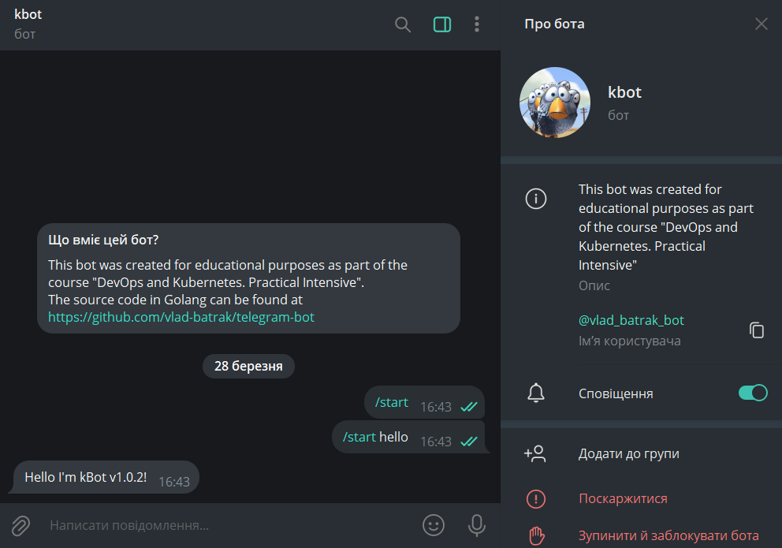

### Завдання 5 ("DevOps та Kubernetes. Практичний інтенсив")

# Coding Session - програмування телеграм бота на мові Golang

Це завдання доволі популярне для новачків, оскільки воно дозволяє отримати базові навички програмування на Golang та використання API для взаємодії зі сторонніми сервісами. Успішне виконання даного завдання допоможете перейти до більш складних задач у розробці програмного забезпечення, а також сприяє підготовці до виконання творчого завдання.

**Ви отримали Технічне Завдання** на розробку функціонального Telegram-бота з кореневою командою та налаштуваннями. Він матиме можливість обробляти повідомлення від користувачів та відповідати на них:
- Мова Golang
- Фреймворки github.com/spf13/cobra та gopkg.in/telebot.v3
- Реалізувати обробники повідомлень для бота, які будуть відповідати на повідомлення в Telegram.
- Створити функції-обробники повідомлень бота.
- Додати ці функції до методів об'єкта telebot.Bot.
- Обробляти повідомлення відповідно до їх типу та вмісту.

<blockquote>

### Це завдання дозволить вам:
- Ознайомитися з основними поняттями та функціями мови Golang.
- Ознайомитися з Telegram Bot API та вивчити як його використовувати для розробки телеграм бота.
- Навчитися створювати та налаштовувати бота для взаємодії з користувачами в телеграмі.
- Практикувати знання з програмування та збільшити свій досвід у розробці програмного забезпечення.
- Зрозуміти потреби та вимоги розробників до інфраструктури.

### Рекомендації до виконання:
1. Встановити Golang та налаштувати середовище розробки (Codespaces вже містить всі необхідні налаштування)
1. Створити новий проєкт на GitHub та налаштувати Git.
1. Додати залежність на бібліотеку github.com/spf13/cobra за домопогою import (практичне завдання продемонстровано в лекції 2.4)
1. Створити Telegram-бота за допомогою BotFather.
1. Отримати токен бота та зберегти його у змінну середовища TELE_TOKEN.
1. Імпортувати необхідні бібліотеки.
1. Встановити бібліотеку gopkg.in/telebot.v3 за допомогою go get.
1. Отримати токен бота зі змінної середовища.
1. Створити об'єкт бота за допомогою telebot.NewBot().
1. Додати обробник повідомлень за допомогою kbot.Handle(telebot.OnText, func(m telebot.Context)
1. Описати функцію-обробник, яка буде відповідати на повідомлення.
1. Зібрати, запустити та перевірити бота
1. Створити файл README з описом проєкту, посиланням на бота у форматі t.me/<Імʼя_бота>_bot, включаючи інструкції для встановлення та приклади використання команд.
1. Завантажити код на GitHub.
1. Надіслати посилання на репозиторій як відповідь

### Очікуваний практичний результат:
- створено початковий код виконання практичного завдання
- перевірений працюючий код закомічено у репозиторій

</blockquote>

## Отриманий результат 

Створено telegram-бота [**@vlad_batrak_bot**](https://t.me/vlad_batrak_bot)

### Вимоги до версій пакетів:
- go v1.22.1
- github.com/spf13/cobra v1.8.0
- gopkg.in/telebot.v3 v3.2.1
- github.com/inconshreveable/mousetrap v1.1.0
- github.com/spf13/pflag v1.0.5

### Команди:
- /start        - ініциалізація спілкування з ботом
- /start hello  - стартує і сповіщає свою версію. Наприклад: "Hello I'm kBot v1.0.2!"
